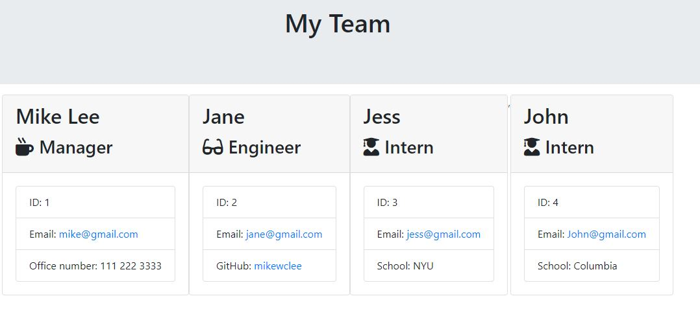

  # Employee-Summary

   
   

  ## Description
  This is a command line application that generates a webpage of info for the software team member. The application will prompt the user for information about the team manager and then information about the team members. The user can input any number of team members, and they may be a mix of engineers and interns. When the user has completed building the team, the application will create an HTML file that displays the team roster based on the information provided by the user.

  Watch online video: https://drive.google.com/file/d/1yKkk3xoYBOFj8YSa1Qti30SgmLvEX2KV/view

  

  ## Table of Contents
  - [Installation](#installation)
  - [Usage](#usage)
  - [License](#license)
  - [Contributors](#contributors)
  - [Tests](#tests)
  - [Questions](#Questions)

  ## Installation
  Packages required to run this program are: fs_inquirer_path

  ## Usage
  A manager can generate a webpage that displays their team's basic info

  ## License
  MIT

  ## Contributors
  Mike Lee

  ## Tests
  npm run test

  ## Contact
  
 
  
GitHub Username: https://github.com/mikewclee
  

  
GitHub Project link: https://github.com/mikewclee/Employee-Summary
  
Contact email: mikewclee@gmail.com